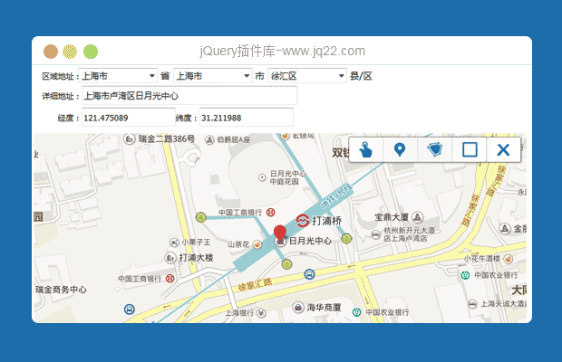
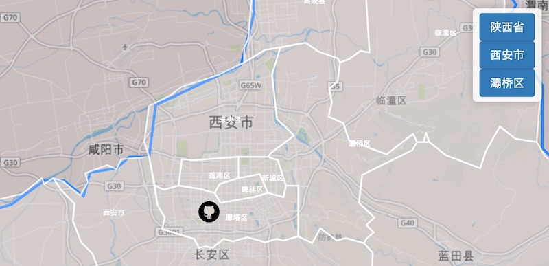
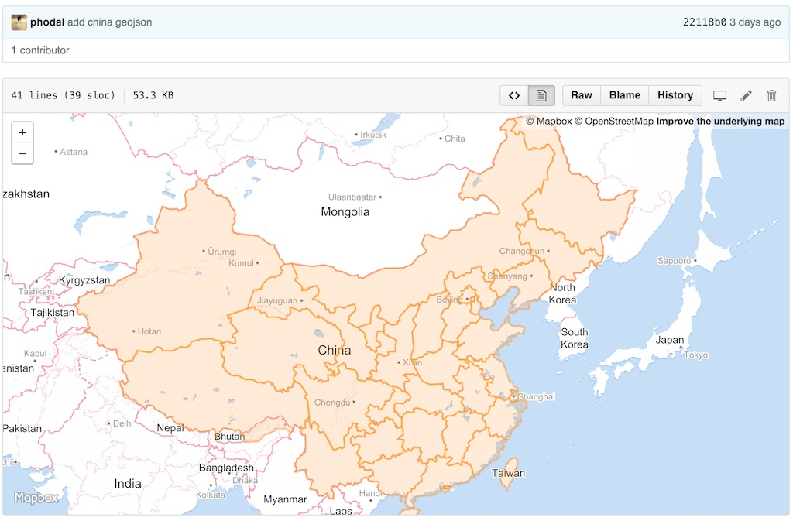

打造基于GitHub的O2O应用：超炫的地点与地图交互
===

或者你已经使用过了相应多的省市区与地图联动，但是这些联动往往是单向的、不可逆。并且这些数据往往都是在线使用的，不能离线使用。下图是一个结合百度地图的省市区与地图联动：

我们可以在这个应用里选择，相应的省市区然后地图会跳转到相应的地图。当我们在地图上漫游的时候，如果没有显示当前的省市区是不是变得很难使用。于是，我们就来创建一个吧：

相关技术栈：

 - Bootstrap，UI显示~~，地球人都知道。
 - jQuery，Bootstrap依赖。
 - Require.js，模块化。
 - Mustache，模板生成。
 - Leaflet，交互地图库。

离线地图与搜索
---

在GitHub上搜索数据的过程中，发现了一个名为[d3js-geojson](https://github.com/ufoe/d3js-geojson)的项目里面放着中国详细省、市、县数据，并且还有及GeoJSON文件。

这就意味着两件事：

 - 地图离线
 - 多边形搜索

###地图离线 

首先，我们要知道GeoJSON是怎样的一个存在。

> GeoJSON是一种对各种地理数据结构进行编码的格式，基于Javascript对象表示法的地理空间信息数据交换格式。GeoJSON对象可以表示几何、特征或者特征集合。GeoJSON支持下面几何类型：点、线、面、多点、多线、多面和几何集合。GeoJSON里的特征包含一个几何对象和其他属性，特征集合表示一系列特征。

换句话来说，根据这个文件里面的多边形，我们可以绘制出中国地图。由于上面的点是真实的地理位置信息，所以无论我们怎样的缩放这些点的位置都不会发生变化。如下图是GitHub对这个数据文件的解析：

（PS: 预览可以打开这个页面：[Vmap GeoJSON](https://github.com/phodal/vmap/blob/gh-pages/static/data/china.json)

当然这似乎不是一个专业人员维护的数据，所以存在一些偏差。但是这些数据意味着，我们不需要依靠于在线地图就可以完成大部分的功能了。在线地图一直都是一个缓慢的存在，并且Google Map在多数人那都是不可用的。

###多边形搜索

接着问题来了，我们并没有把每个用户的数据存入到数据库中，那么我们怎么才能实现搜索？

